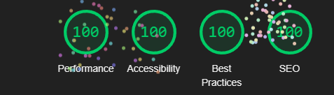

## Shape competition
A user can submit a shape created using a simple polygon tool, with the user's name, the shape name, the description, and whether or not the shape is named after the user. The goal of the application is to provide a whimsical learning experience for the developer in which basic server functionality is implemented. Users can have fun creating shapes and viewing other user's creations.

https://a3-notleohirano.glitch.me

username: user

password: pass

I had challenges with session implementation. I chose to implement passport local with session management because I wanted to learn more about using cookies.
I used NES.css because the site is meant to be retro, whimsical, and not super utilitarian.

## Technical Achievements
- **Tech Achievement 1**: session management
- **Tech Achievement 2**: 100 in all 4 categories
- **Tech Achievement 3**: Vercel deployment. I found that the pages routing was a bit confusing but there seems to be more options I could explore later on. I had an automatic redirect that was hard to get in Vercel. I think that glitch deployment was more intuitive this time but it is worth exploring again
- **Tech Achievement 4**: passport local

### Design/Evaluation Achievements
